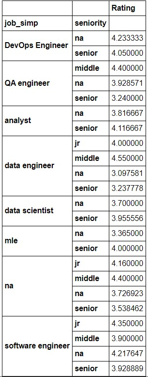
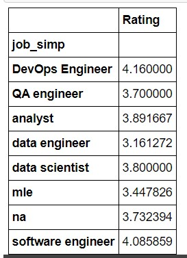
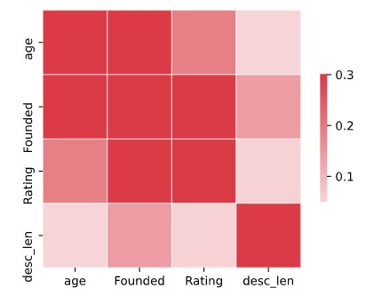

# Data - Software Job Rating Estimator: Project Overview 
* Created a tool that estimates data science salaries (MAE ~ 4.03 out of 5) to help data scientists have an idea of how good a job opportunity can be based on a bunch of details from a company.
* Scraped over 500 job descriptions in South America from glassdoor using python and selenium. The countries involved were the following ones: Peru, Colombia, Argentina, Chile and Brazil.
* Engineered features from the text of each job description to quantify the value companies put on python, excel, sql, aws, gcp, azure and spark. 
* Optimized Linear, Lasso, and Random Forest Regressors using GridsearchCV to reach the best model. 
* Built a client facing API using Flask 

## Code and Resources Used 
**Python Version:** 3.7  
**Packages:** pandas, numpy, sklearn, matplotlib, seaborn, selenium, flask, json, pickle  
**For Web Framework Requirements:**  ```pip install -r requirements.txt```  
**Scraper Github:** https://github.com/arapfaik/scraping-glassdoor-selenium  
**Scraper Article:** https://towardsdatascience.com/selenium-tutorial-scraping-glassdoor-com-in-10-minutes-3d0915c6d905  
**Flask Productionization:** https://towardsdatascience.com/productionize-a-machine-learning-model-with-flask-and-heroku-8201260503d2

## Web Scraping
Tweaked the web scraper github repo (above) to scrape 1000 job postings from glassdoor.com. With each job, we got the following:
*	Job title
*	Rating Estimate
*	Job Description
*	Company 
*	Location
*	Company Size
*	Company Founded Date
*	Type of Ownership 
*	Industry
*	Sector
*	Revenue
*   Age

## Data Cleaning
After scraping the data, I needed to clean it up so that it was usable for our model. I made the following changes and created the following variables:

*	Removed columns such as Headquarters and Competitor
*	Removed rows without salary (all of them were empty)
*	Parsed rating out of company text 
*	Made a new column for company Location in those 5 countries 
*	Transformed founded date into age of company (based on year as 2020) 
*	Made columns for if different skills were listed in the job description:
    * Python  
    * R  
    * SQL
    * GCP
    * Azure
    * Excel  
    * AWS  
    * Spark 
*	Column for simplified job title and Seniority 
*	Column for description length 

## EDA
I looked at the distributions of the data and the value counts for the various categorical variables. Below are a few highlights from the pivot tables. 

* Rating by Job Position & Seniority: 
* 
* Rating by Job Position:
* 
* Correlations
*  
* Rating by Job Position:
* 

## Model Building 

First, I transformed the categorical variables into dummy variables. I also split the data into train and tests sets with a test size of 20%.   

I tried three different models and evaluated them using Mean Absolute Error. I chose MAE because it is relatively easy to interpret and outliers aren’t particularly bad in for this type of model.   

I tried three different models:
*	**Multiple Linear Regression** – Baseline for the model
*	**Lasso Regression** – Because of the sparse data from the many categorical variables, I thought a normalized regression like lasso would be effective.
*	**Random Forest** – Again, with the sparsity associated with the data, I thought that this would be a good fit. 

## Model performance
The Random Forest model far outperformed the other approaches on the test and validation sets. 
*	**Random Forest** : MAE =  -0.5075862068965519
*	**Linear Regression**: MAE =  -0.7724895209382092
*	**Ridge Regression**: MAE = -0.7911414218263703

## Productionization 
In this step, I built a flask API endpoint that was hosted on a local webserver by following along with the TDS tutorial in the reference section above. The API endpoint takes in a request with a list of values from a job listing and returns an rating evaluation. 


